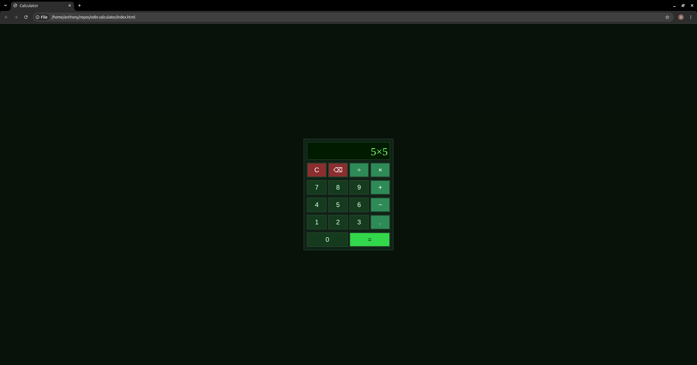

# odin-calculator

This is a browser-based calculator that I built as part of The Odin Project Foundations curriculum.

## Live demo
[Try it!](https://aeochoa99.github.io/odin-calculator/)

## Features

* Addition, subtraction, multiplication, division
* Evaluates only a pair of numbers at a time — e.g. `12 + 7` followed by pressing `-` evaluates `12 + 7` first (giving `19`), then waits for the next number to subtract from it.
* Decimal input
* Clear button
* Single character delete button
* Guards against common edge cases:
  * Divide by zero shows a message instead of `Infinity`
  * Deleting with an empty display doesn't throw an error
  * Leading operator input (e.g pressing `+` before any number) is ignored
* Retro terminal inspired dark theme

## Built with

* HTML5
* CSS3 (Flexbox layout)
* Vanilla JavaScript

## How it works

The calculator tracks state in a single `equation` object (`constantOne`, `operator`, `constantTwo`, `result`). Only one operator can be pending at a time. When a second operator is pressed, the calculator evaluates the current pair immediately, then stores the result as the new `constantOne` alongside the new operator.

## Running locally

Open your terminal and clone the repository, then open index.html

1. git clone git@github.com:aeochoa99/odin-calculator.git
2. cd odin-calculator
3. open index.html

## Acknowledgments

Project brief from [The Odin Project](https://www.theodinproject.com/lessons/foundations-calculator)